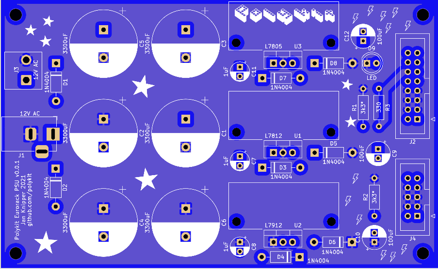

# Eurorack Power Supply

This repository contains KiCad schematics and PCB layout for an Eurorack power supply. It delivers +12V, -12V and +5V. A 12V AC/AC 1A to 2A wall wart power supply is needed. Gerber files can be found [here](plots/)

## BOM

|Reference               |Quantity|Value                                             |
|------------------------|--------|--------------------------------------------------|
|C1 C2 C3 C4 C5 C6       |6       |3300uF                                            |
|C9 C10 C12              |3       |100uF                                             |
|C7 C8 C11               |3       |1uF                                               |
|D1 D2 D3 D4 D5 D6 D7 D8 |8       |1N4004                                            |
|D9                      |1       |LED 5mm                                           |
|J1                      |1       |Barrel Jack Socket 5.5mm/2.1mm                    |
|J2                      |1       |IDC 16-pin                                        |
|J3                      |1       |2-pin 5.4mm**                                     |
|J4                      |1       |IDC 10-pin                                        |
|R1 R2                   |2       |3k3*                                              |
|R3                      |1       |330                                               |
|U1                      |1       |L7812                                             |
|U2                      |1       |L7912                                             |
|U3                      |1       |L7805                                             |
|Heatsink                |3       |for TO-220 (max. size 30mm x 13mm) eg. SK 145/37,5|

\* load resistors can be omitted

\** alternative connector to barrel jack

## References

http://musicfromouterspace.com/analogsynth_new/WALLWARTSUPPLY/WALLWARTSUPPLY.php
